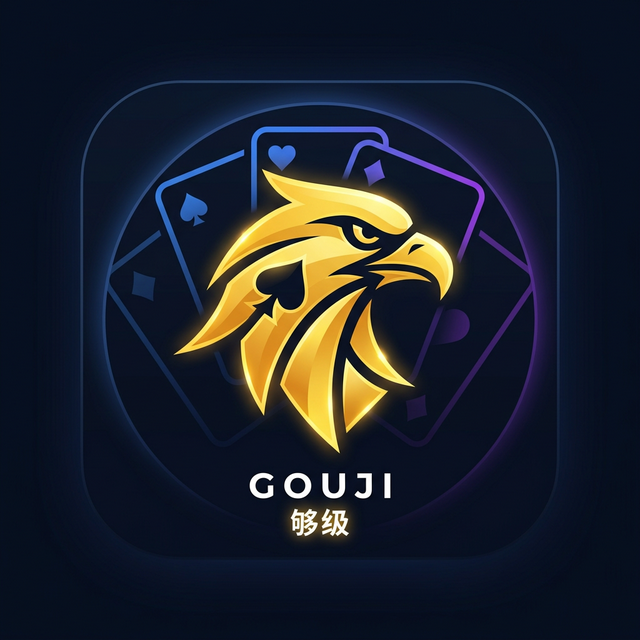

# 够级记牌器 Pro



够级记牌器 Pro 是一个专为山东特色扑克游戏“够级”打造的纯前端移动端 Web 辅助工具。它可以帮助玩家在激烈的对局中，精准记录关键牌型的消耗情况，辅助算牌和掌控牌权。

🌐 **在线体验**: [https://nullpointerxyz.github.io/gouji-counter/](https://nullpointerxyz.github.io/gouji-counter/)

## ✨ 核心特性

- **🎮 多游戏模式支持**
  - **经典四副牌模式**: 适合传统的四副牌玩法。
  - **六副牌模式**: 适合更多牌量、更广受众的六副牌玩法。
  - **六副牌带鹰模式**: 针对特定地区流行的“带鹰（通常为一张额外的牌，本项目配置为6张）”玩法，让计算更加精确。

- **🧮 关键牌型精准追踪**
  - 专属的大鹰、大王、小王、2 的计数面板。
  - 动态的状态颜色反馈：随着余牌减少，数字颜色会自动从安全色（白/蓝）变为警告色（黄），最后变为危险色（红）。
  - 支持快捷出牌：根据牌型提供 `出1张` 到 `出8张` 的快捷点按按钮。
  - 智能防误触：余牌不足时自动禁用相关的出牌按钮。

- **👀 对门够级牌状态监控**
  - 在实战中，记住对手是否发过“够级牌”至关重要。
  - 专属追踪器区域支持快捷标记对门是否已出过 `10`, `J`, `Q`, `K`, `A`。点击即可高亮切换状态，不再需要死记硬背。

- **⏪ 撤回功能**
  - 激战正酣容易手滑点错？每张关键牌都支持“撤回上一步”操作，再也不怕按错打乱记牌节奏。

- **📱 极致的移动端沉浸体验**
  - **原生应用级手感**: 采用纯 HTML5 + CSS3 + Vanilla JS 构建，轻量且流畅。禁止了双击放大、下拉刷新等原生网页行为（overscroll-behavior-y: none），体验媲美原生App。
  - **现代化深色电竞UI**: 采用 Glassmorphism（玻璃拟态）、霓虹发光文字、高对比度黑夜模式设计，即使在长时间的牌局中观看也不伤眼，界面炫酷高级。
  - **一屏全展示**: 精心优化的界面布局，在大多数手机屏幕上均可**无需上下滑动**完整显示所有操作区域。
  - **震动反馈**: 接入 H5 震动 API，每一次出牌、撤销、或者切换追踪器状态都会有明确且轻微的震动反馈（仅支持 Android 和部分系统），盲按也能心中有数。

## 🛠 技术栈

- **HTML5**: 采用语义化标签构建。
- **CSS3 / CSS Variables**: 使用原生 CSS 变量管理颜色主题，Flexbox + Grid 进行全响应式布局。
- **JavaScript (Vanilla)**: 零外部框架依赖（无 Vue/React），确保秒开和极致的运行性能。

## 🚀 如何运行和部署

本项目为纯前端静态页面，无需任何后端环境或构建工具（Webpack/Vite）。

### 本地运行
您可以直接使用任何你喜欢的本地服务器即可预览：
```bash
# 例如使用 Python
python3 -m http.server 8000
```
或直接在浏览器中打开 `index.html` 文件即可。

### 自动化部署
本项目配置了推送到 GitHub 时，自动通过 GitHub Pages 构建和发布。只需访问你对应的 `https://[username].github.io/gouji-counter/` 即可在手机端添加书签或添加到主屏幕使用。

## 📝 贡献与修改

欢迎 Fork 本项目并根据您当地的“够级”特色规则修改：
- 若需修改不同模式下的牌数，请修改 `app.js` 顶部的 `CONFIG` 常量。
- 若需修改界面元素，请直接编辑 `index.html`。
- 若需修改主题色和布局，请查看 `style.css`。

## 📜 许可证

MIT License
